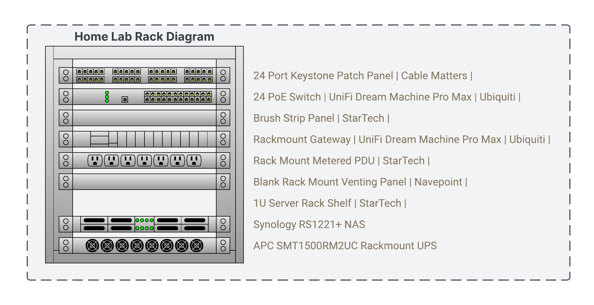
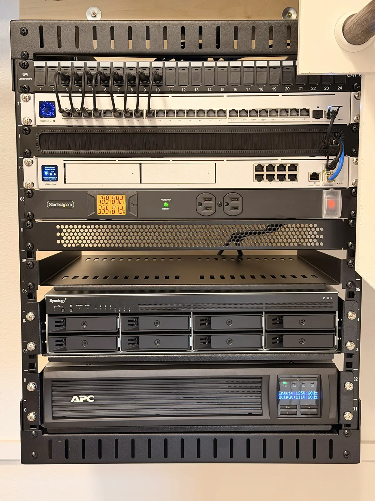
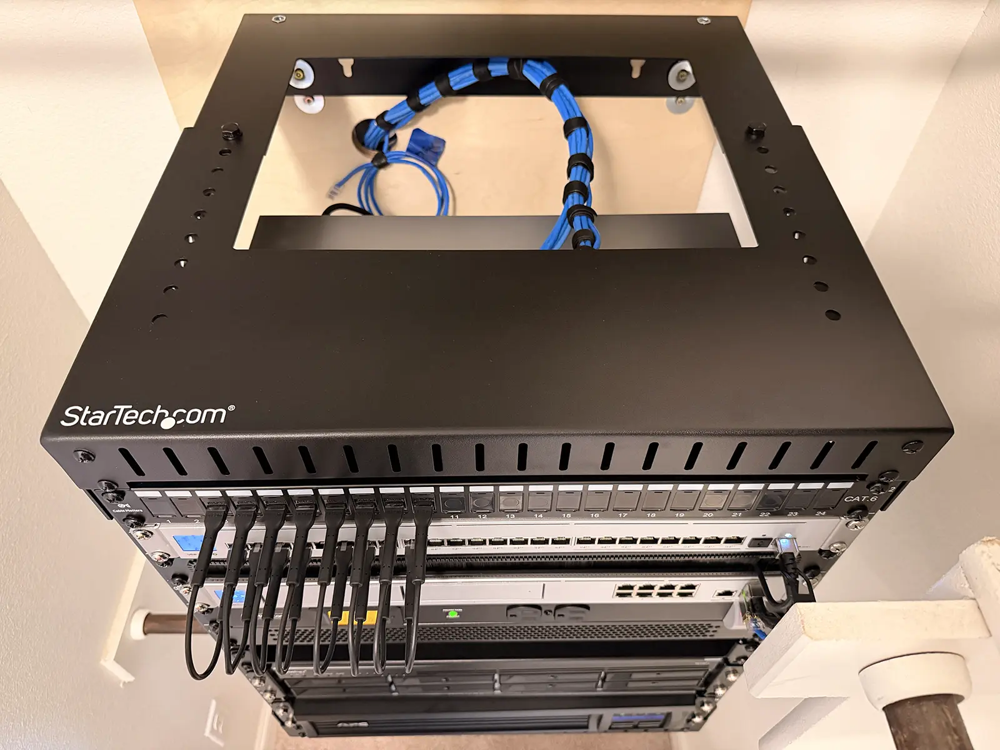
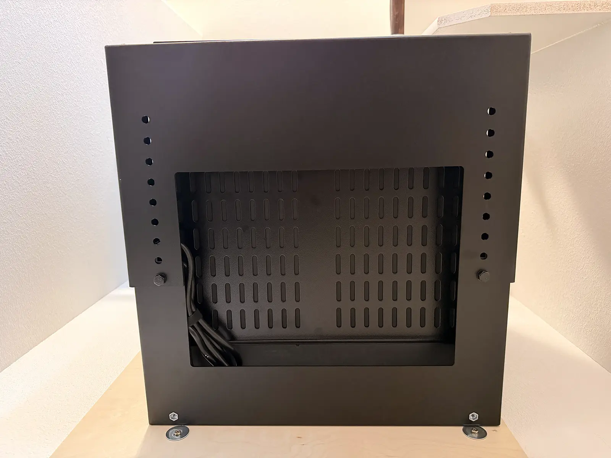
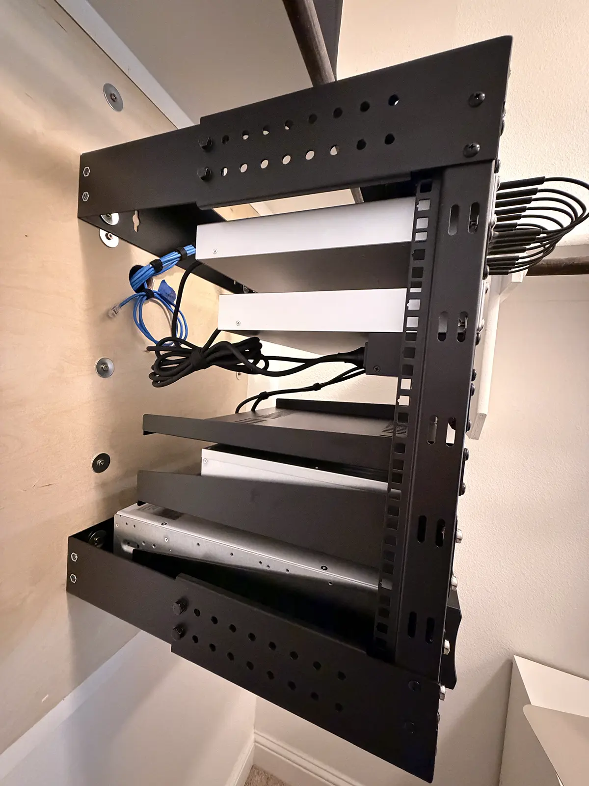
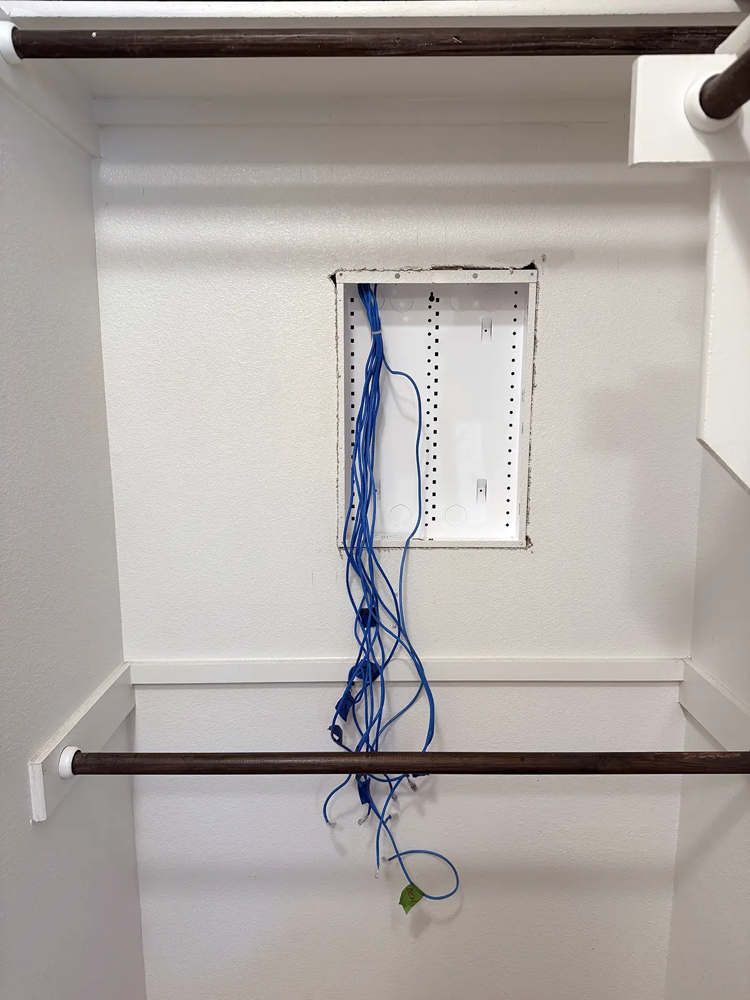
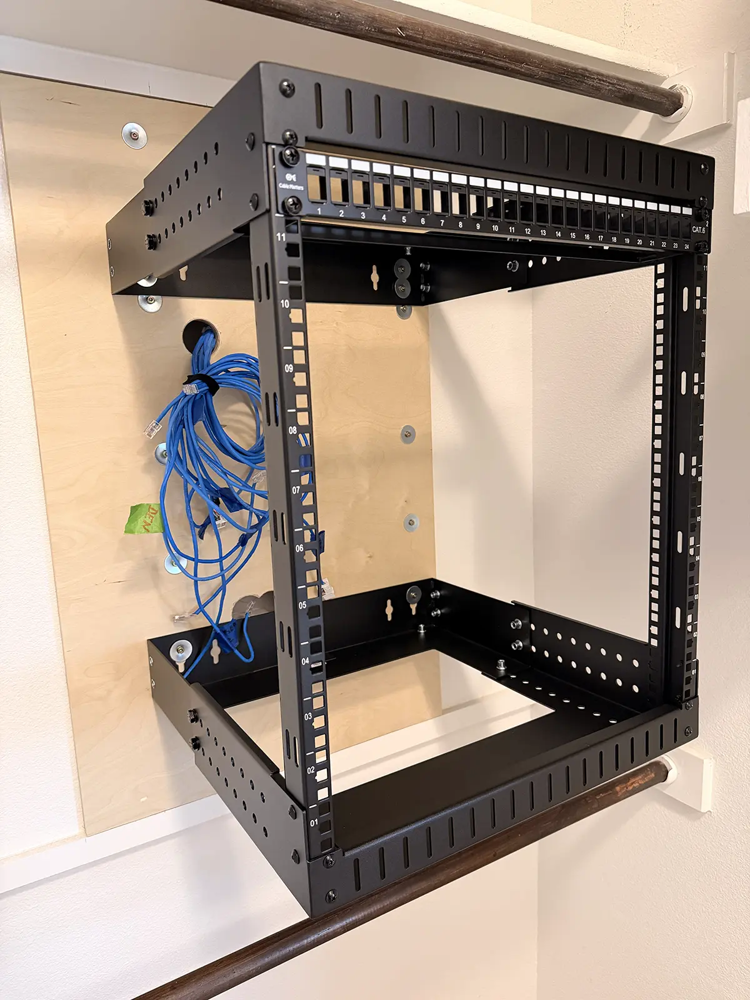
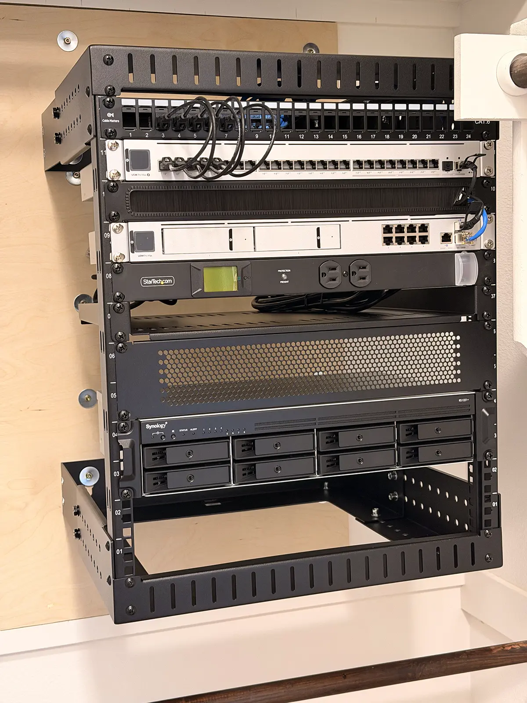
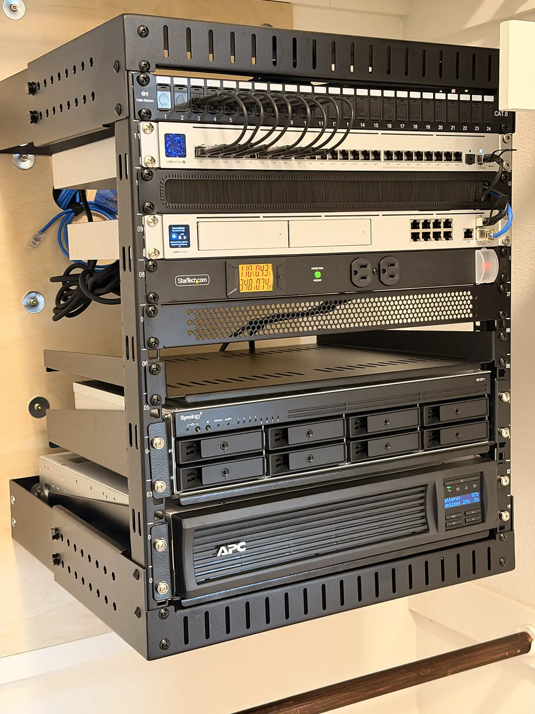

# Homelab Infrastructure

Personal infrastructure lab used for learning and practicing Linux, networking, and system administration.

This environment is used to experiment with virtualization, container workloads, and network services in a controlled home environment.

---

## Goals
- Learn Linux administration
- Practice networking and infrastructure concepts
- Build and maintain a small home datacenter
- Experiment with virtualization and container workloads
- Document infrastructure architecture

---

## Current Infrastructure

### Network
- UDM Pro Max (router / firewall)
- UniFi Switch
- Structured cabling with patch panel

### Storage
- Synology RS1221+
- RAID storage for lab services and backups

### Power
- APC rack UPS for power protection

### Workstations
- Falcon Talon workstation
Ryzen 7 • RTX 5090 • 96GB RAM • 16TB NVMe  
- Mac Studio M1 Max
Main workstation for development and documentation

---

## Planned Lab Expansion

### Future additions for cluster and virtualization experiments:
- 3× Dell OptiPlex Micro nodes
- Linux virtualization cluster
- container workloads

---

## Lab Architecture

Below is the current physical rack layout of the homelab infrastructure.

Diagram of the home lab rack layout including patch panel,
PoE switch, gateway, NAS storage and UPS power system.

---

## Infrastructure Stack

**Networking**

- UniFi UDM Pro Max
- UniFi Switch
- Structured CAT5e cabling

**Storage**

- Synology RS1221+
- RAID storage

**Power**

- APC Rack UPS

**Compute**

- Falcon Talon Workstation  
  Ryzen 7 • RTX 5090 • 96GB RAM

- Mac Studio M1 Max

**Future Lab Nodes**

- Dell OptiPlex Micro cluster (planned)

---

## Documentation

- [Rack Layout](docs/rack-layout.md)
- [Network Infrastructure](docs/network.md)
- [Infrastructure Services](docs/services.md)

---

## Learning Focus

### Current areas of study:
- Linux administration
- networking fundamentals
- infrastructure architecture
- virtualization
- containers

---

## Physical Rack

Front view of the completed home lab rack.

---

### Rack Details

Top view showing cable routing and patch panel connections.

Bottom view showing UPS and Synology NAS placement.

Side view of the wall-mounted 12U rack frame.

---

## Rack Build Progress

Initial installation of the wall-mounted rack and infrastructure setup.

### Empty wall and network entry

### Rack installation

### Network equipment installation

### Final rack lauout

---

## Notes

This lab is continuously evolving as new infrastructure and experiments are added.

---

# Author

Eugene Ivanov  
Infrastructure / IT Operations  
Austin, Texas

Website  
https://eugeneivanov.dev

LinkedIn  
https://www.linkedin.com/in/eugeneivanov-dev
